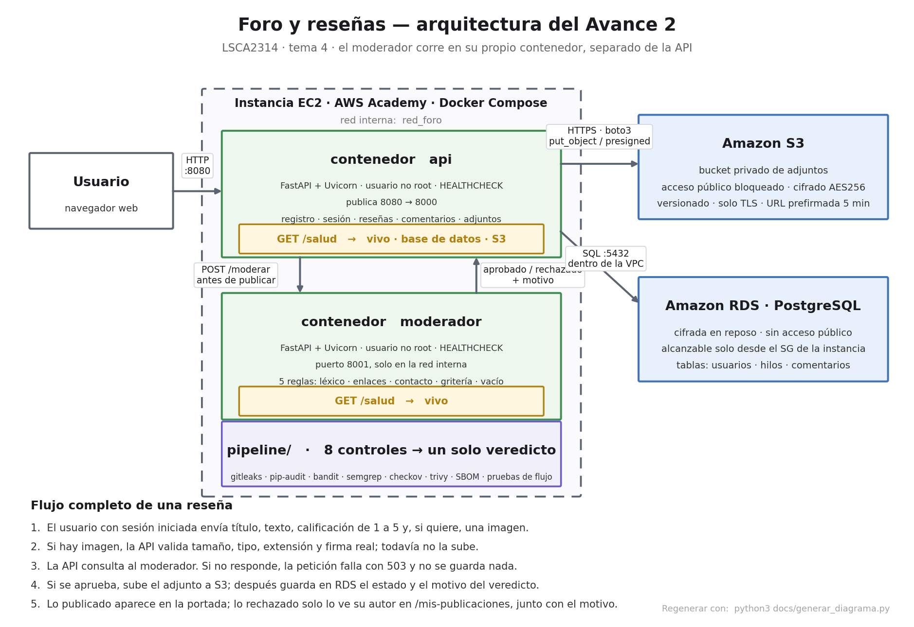

# Foro y reseñas

LSCA2314 · Herramientas de Tecnologías de Información · El Reto, Avance 2
Tema 4: Foro y reseñas · Trabajo individual

## Qué hace

Un foro donde los usuarios registrados publican reseñas (título, texto y
calificación de 1 a 5), comentan las de otros y pueden adjuntar una imagen.
**Todo el contenido pasa primero por un servicio de moderación** que corre en su
propio contenedor: si lo aprueba se publica, y si lo rechaza no aparece en el
foro y el autor ve el motivo en `/mis-publicaciones`.

La pieza técnica distintiva del tema es justamente ese servicio de moderación
separado. No es una función dentro de la API: es otro contenedor, con su propia
imagen y su propio proceso, al que la API le habla por HTTP.

## Arquitectura



| Servicio | Contenedor | Puerto | Qué hace |
|---|---|---|---|
| `api` | `foro-resenas-api` | 8080 en la instancia → 8000 en el contenedor | Interfaz web, registro y sesión, publicación, persistencia en RDS, adjuntos en S3 |
| `moderador` | `foro-resenas-moderador` | 8001, **solo en la red interna** | Recibe texto, aplica cinco reglas y devuelve aprobado o rechazado con motivo |

El moderador no publica puertos al exterior: solo se le puede hablar desde la
red de compose. Si estuviera expuesto, cualquiera podría consultarlo o saturarlo
desde fuera de la instancia.

### Servicios de AWS que usa

| Servicio | Para qué | Cómo se comprueba que se usa de verdad |
|---|---|---|
| **S3** | Guarda las imágenes adjuntas de las reseñas. Bucket privado, con acceso público bloqueado y cifrado AES256 | Al publicar una reseña con imagen aparece un objeto nuevo bajo `adjuntos/` en el bucket. La imagen **no** se sirve por URL pública: `/adjunto/{id}` genera una URL prefirmada de 5 minutos, y solo para usuarios con sesión |
| **RDS PostgreSQL** | Guarda usuarios, hilos y comentarios. Cifrada, sin acceso público, alcanzable solo desde el security group de la instancia | Registrar un usuario y publicar una reseña crea filas en `usuarios` y `hilos`. `GET /salud` reporta `base_datos: ok` porque ejecuta una consulta real contra RDS |

### Endpoints principales

| Ruta | Método | Para qué |
|---|---|---|
| `/salud` | GET | Dice si la aplicación está viva y si alcanza la base y el bucket. **Alcance: no prueba autenticación ni los flujos de negocio** — eso lo hace la etapa 08 del pipeline |
| `/salud/dependencias` | GET | Salud extendida: estado del servicio de moderación |
| `/registro`, `/entrar`, `/salir` | GET/POST | Alta de usuario y sesión por cookie firmada |
| `/` | GET | Portada con las reseñas publicadas y la calificación promedio |
| `/hilos` | POST | Publica una reseña (pasa por moderación) |
| `/hilos/{id}` | GET | Reseña con sus comentarios publicados |
| `/hilos/{id}/comentarios` | POST | Comenta (pasa por moderación) |
| `/mis-publicaciones` | GET | Lo propio, incluido lo rechazado y su motivo |
| `/adjunto/{id}` | GET | Redirige a la URL prefirmada del adjunto en S3 |

## Requisitos previos

- Docker y Docker Compose en la instancia
- Python ≥ 3.10 para el pipeline (Amazon Linux 2023 trae 3.9: `sudo dnf install -y python3.11`)
- Un bucket S3 y una base RDS creados en la cuenta de AWS Academy
- Credenciales de AWS (rol de la instancia o llaves temporales del Learner Lab)

## Configuración

Toda la configuración entra por variables de entorno. **No hay ni una credencial
en el código.**

```bash
cp .env.ejemplo .env
# Edita .env con los datos de tu bucket y tu base.
# Genera la llave de sesión con:
python3 -c "import secrets; print(secrets.token_urlsafe(48))"
```

`.env` nunca se sube al repositorio: está en `.gitignore` y la etapa 01 del
pipeline lo vuelve a comprobar en cada corrida.

| Variable | Qué es |
|---|---|
| `ENTORNO` | `desarrollo`, `qa` o `produccion` |
| `URL_BASE_DATOS` | Cadena de conexión a RDS (`postgresql+psycopg2://...`) |
| `BUCKET_S3`, `REGION_AWS` | Bucket de adjuntos y su región |
| `CLAVE_SESION` | Llave de firma de las cookies de sesión. Sin valor por defecto: si falta, la aplicación no arranca |
| `URL_MODERADOR`, `TIMEOUT_MODERADOR_SEG` | Dónde vive el moderador y cuánto se le espera |
| `MAX_BYTES_ADJUNTO` | Tamaño máximo de imagen aceptado |

## Cómo se levanta

```bash
# 1. Fija la imagen base por digest real (usa tu propio docker pull)
bash pipeline/fijar_imagen_base.sh

# 2. Construye y levanta los dos contenedores
docker compose build
docker compose up -d

# 3. Comprueba
curl http://localhost:8080/salud
docker compose ps        # los dos servicios, el moderador en healthy
```

La aplicación queda en `http://<ip-de-tu-instancia>:8080`.

### Limitaciones conocidas del entorno QA

La demostración usa HTTP directo en el puerto 8080 porque el Learner Lab no
tiene terminación TLS configurada. Por ello `COOKIE_SEGURA=false`: la cookie
está firmada, pero el navegador no exige transportarla por HTTPS. Producción
requiere HTTPS y `COOKIE_SEGURA=true`.

La conexión a PostgreSQL usa `sslmode=require`, que cifra el transporte pero no
verifica por sí solo la identidad del servidor como lo haría `verify-full`.

## Infraestructura como código

`infra/*.tf` describe el bucket y la base: bloqueo de acceso público en sus
cuatro interruptores, cifrado en reposo, versionado, política que exige TLS,
RDS cifrada sin acceso público y un security group que solo acepta PostgreSQL
desde el security group de la instancia.

```bash
cd infra
terraform init
terraform validate
```

Si los recursos se crearon por consola o AWS CLI, no se ejecuta `terraform plan`
como si Terraform ya los administrara: primero haría falta importarlos al
estado. Para el Avance 2, `terraform validate` y Checkov validan la descripción,
y AWS CLI más las capturas comprueban la infraestructura desplegada.

Las variables sin valor por defecto (`nombre_bucket`, `id_vpc`,
`ids_subredes_base`, `sg_instancia_aplicacion`, `version_motor`,
`contrasena_base_datos`) se pasan por `TF_VAR_*` o por un `.tfvars` que **no**
se versiona: el archivo de estado de Terraform guarda la contraseña en claro.

## El pipeline de seguridad

```bash
bash pipeline/preparar_herramientas.sh     # una sola vez
bash pipeline/orquestador.sh               # las 8 etapas y el veredicto
```

Ocho controles que terminan en un solo veredicto: `DESPLIEGUE PERMITIDO`
(salida 0) o `DESPLIEGUE BLOQUEADO` (salida 1). El detalle de por qué está cada
etapa y con qué umbral bloquea está en
[`tabla_decisiones_pipeline.md`](tabla_decisiones_pipeline.md).

| Etapa | Control | Herramienta |
|---|---|---|
| 01 | Secretos en código e historial | gitleaks |
| 02 | Dependencias vulnerables | pip-audit |
| 03 | Patrones inseguros en Python | bandit |
| 04 | Reglas propias del foro | semgrep (reglas locales) |
| 05 | Infraestructura y Dockerfiles | checkov |
| 06 | Vulnerabilidades de las imágenes | trivy |
| 07 | Inventario de componentes (SBOM) | cyclonedx-py |
| 08 | Flujos y autorización en ejecución | pruebas propias con httpx |

Otros comandos:

```bash
bash pipeline/probar_puerta.sh   # comprueba que la puerta permite y bloquea como se documenta
URL_APLICACION=http://localhost:8080 bash pipeline/orquestador.sh
```

## Estructura del repositorio

```
app/api/            código de la API del foro
app/moderador/      servicio de moderación (pieza distintiva)
Dockerfile          imagen de la API
Dockerfile.moderador imagen del moderador
docker-compose.yml  orquestación de los dos contenedores
infra/              Terraform del bucket y la base
pipeline/           las 8 etapas, el orquestador y sus reglas
reportes/           salidas del pipeline y SBOM
docs/               esta documentación
```
