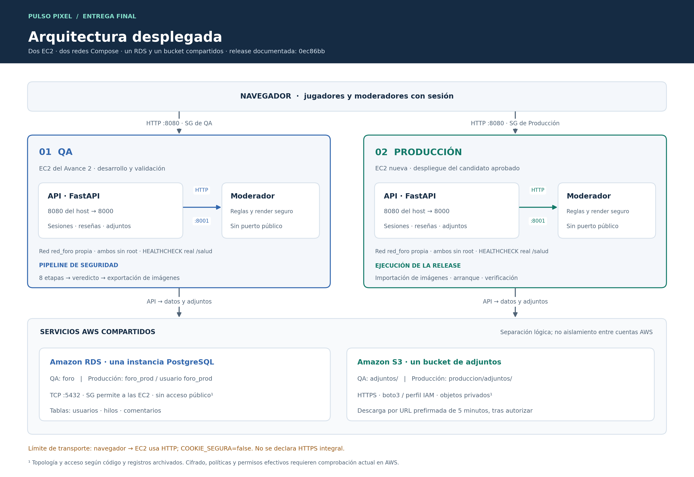
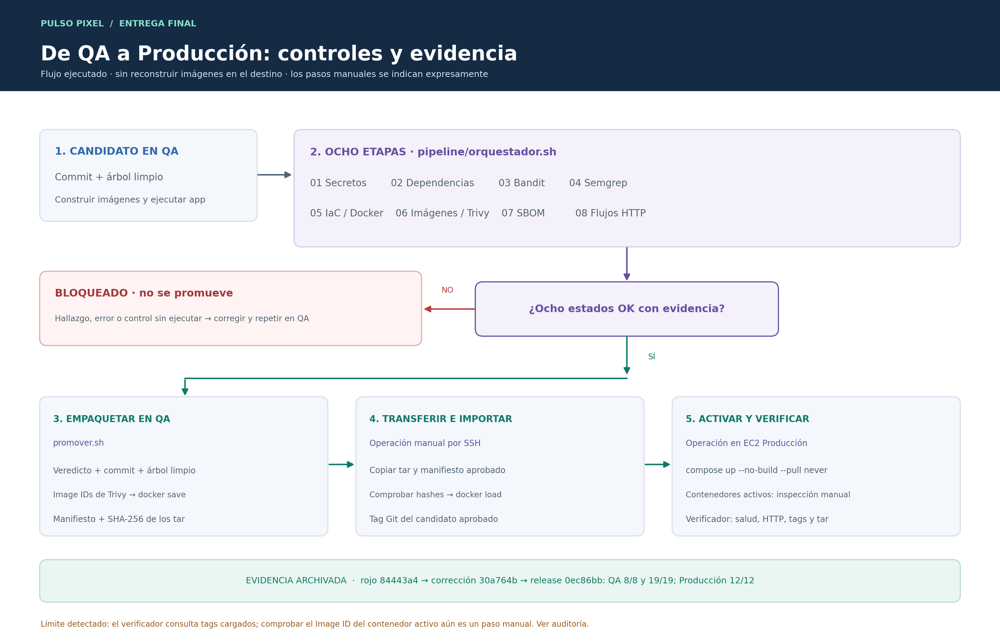

# Arquitectura y puerta de promoción

## Topología desplegada

[Versión vectorial editable](diagrama_arquitectura.svg). El diagrama corresponde a **dos EC2 efectivamente creadas**: una de QA y otra de Producción. Los identificadores se comprueban en las capturas privadas de AWS. Las bases `foro` y `foro_prod` están dentro del **mismo RDS**; los prefijos QA y Producción pertenecen al **mismo bucket**. No representan cuatro recursos independientes.

Los registros de despliegue muestran conectividad de Producción con RDS y S3, RDS privado y PostgreSQL autorizado desde los grupos de las aplicaciones. El moderador no publica un puerto al host: recibe peticiones desde la red de Compose. La API controla la autorización; los adjuntos privados se entregan mediante URLs firmadas de duración limitada. Las comprobaciones históricas no sustituyen revisar las reglas y permisos actuales de AWS.

La navegación del laboratorio usa **HTTP en 8080**, no HTTPS. Las bases y los prefijos distintos aportan separación lógica; no prueban por sí mismos aislamiento de permisos DB/IAM. Los límites y las lecturas pendientes constan en la [revisión final](auditoria/revision_final_2026-09-27.md).

## Promoción de la misma imagen

[Versión vectorial editable](diagrama_promocion.svg). La transferencia y el despliegue fueron manuales: `promover.sh` verifica y empaqueta. SHA-256 permite comprobar integridad; la confianza en el manifiesto depende de su origen y del canal utilizado. La rama de endurecimiento añade al verificador la comprobación de los contenedores activos, su estado/salud, el checkout y un total explícito de 15 controles; su corrida real en QA/Producción aún debe ejecutarse. La evidencia histórica conserva el comportamiento anterior y no se reetiqueta.

## Fronteras de confianza

| Flujo | Control aplicado | Evidencia esperada |
|---|---|---|
| Autor → API → moderador | Toda reseña y comentario pasa por `/moderar` antes de publicarse; si falla la conexión, se bloquea la publicación | T5, T6b y el servicio saludable |
| Autor → RDS → vista pública | Jinja escapa el texto; la portada obtiene hasta tres comentarios por reseña desde SQL | T6, T11 y capturas; T11a/T11b/T11 documentan los casos de cero, uno y cuatro comentarios |
| Moderador humano → API → moderador interno | Sesión, correo reservado y cuenta preaprovisionada; proxy con `resena_id` | T10, T10b y T10c |
| Reseña guardada → HTML de vista previa | Escapar texto antes de generar negritas/saltos | XSS bloqueada en rojo y T10d/T10e verdes tras remediar |
| QA → Producción | Veredicto completo, mismo commit, árbol limpio e Image IDs examinados por Trivy; SHA-256 al transferir y comprobación manual de `.Image` de los contenedores | `veredicto.json`, `06_image_ids.json`, `manifest_release.json` y registros de EC2 nueva; automatización reforzada en la rama de endurecimiento; pendiente de validar en QA |

## Secuencia que evalúa el profesor

| Paso | Estado de QA | Salida que debe guardarse |
|---|---|---|
| Parche vulnerable | Función del docente portada sin eliminar el defecto | Diff de integración y respuesta vulnerable en entorno controlado |
| Pipeline original | Misma versión, sin regla XSS nueva | Corrida y brecha documentada si no bloquea |
| Cobertura dirigida | SAST + prueba HTTP con autor y moderador distintos | Veredicto BLOQUEADO por XSS real |
| Contención y corrección | Endpoint restringido temporalmente; HTML seguro instalado | Diagnóstico, respuesta e historial de commits |
| Integración pública | Feed con extracto y tres comentarios | Capturas comparables, prueba T11 |
| Candidato completo | Ocho etapas ejecutadas sobre imagen y código final | Veredicto PERMITIDO, IDs de imágenes examinadas |
| EC2 nueva | Solo artefactos de QA verde, configuración separada | Validación de salud, identidad y bitácora de problemas de despliegue |

La aplicación desplegada en Producción terminó 12/12 comprobaciones del destino. La entrega académica aún requiere incorporar las capturas a la plantilla oficial y atender los hallazgos de la revisión final. Los diagramas describen la arquitectura y el procedimiento documentados; no sustituyen capturas ni consultas de AWS.

La selección de tres comentarios por reseña emplea la función de ventana
[`row_number()` de SQLAlchemy 2.0](https://docs.sqlalchemy.org/en/20/tutorial/data_select.html#using-window-functions).
