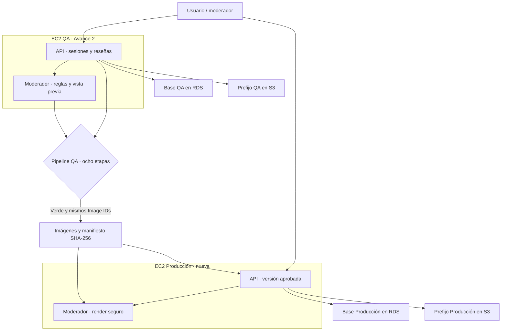

# Arquitectura y puerta de promoción

## Topología desplegada

El diagrama corresponde a **dos EC2 efectivamente creadas**: QA `i-05cc3223adae222ef` y Producción `i-089d62a1e8fdea7bb`. Los nodos `QA_DB` y `P_DB` son dos bases lógicamente separadas (`foro` y `foro_prod`) dentro del **mismo RDS**, y los dos nodos S3 son prefijos distintos dentro del **mismo bucket**, no servidores adicionales. La aplicación de Producción verificó sus conexiones a RDS y S3. El servicio moderador solo tiene acceso desde la red interna de Compose; la API es la frontera de autorización. El RDS no publica 5432 a Internet. Los adjuntos permanecen privados y la API genera URLs firmadas de duración limitada.

## Fronteras de confianza

| Flujo | Control aplicado | Evidencia esperada |
|---|---|---|
| Autor → API → moderador | Toda reseña y comentario pasa por `/moderar` antes de publicarse; si falla la conexión, se bloquea la publicación | T5, T6b y el servicio saludable |
| Autor → RDS → vista pública | Jinja escapa el texto; la portada obtiene hasta tres comentarios por reseña desde SQL | T6, T11 y capturas de 0/1/3/4 comentarios |
| Moderador humano → API → moderador interno | Sesión, correo reservado y cuenta preaprovisionada; proxy con `resena_id` | T10, T10b y T10c |
| Reseña guardada → HTML de vista previa | Escapar texto antes de generar negritas/saltos | XSS bloqueada en rojo y T10d/T10e verdes tras remediar |
| QA → Producción | Veredicto completo, mismo commit, árbol limpio e Image IDs examinados por Trivy; comprobar SHA-256 al transferir | `veredicto.json`, `06_image_ids.json`, `manifest_release.json` y registros de EC2 nueva |

## Secuencia que evalúa el profesor

| Paso | Estado de QA | Salida que debe guardarse |
|---|---|---|
| Parche vulnerable | Función del docente portada sin eliminar el defecto | Diff de integración y respuesta vulnerable en entorno controlado |
| Pipeline original | Misma versión, sin regla XSS nueva | Corrida y brecha documentada si no bloquea |
| Cobertura dirigida | SAST + prueba HTTP con autor y moderador distintos | Veredicto BLOQUEADO por XSS real |
| Contención y corrección | Endpoint restringido temporalmente; HTML seguro instalado | Diagnóstico, respuesta e historial de commits |
| Integración pública | Feed con extracto y tres comentarios | Capturas comparables, prueba T11 |
| Candidato completo | Ocho etapas ejecutadas sobre imagen y código final | Veredicto PERMITIDO, IDs de imágenes examinadas |
| EC2 nueva | Solo artefactos de QA verde, configuración separada | Validación de salud, identidad y bitácora de problemas de despliegue |

La aplicación desplegada en Producción terminó 12/12 comprobaciones del destino. La entrega académica aún requiere incorporar capturas comparables a la plantilla oficial. El diagrama ilustra la topología comprobada, pero no sustituye la captura de AWS que acredita los Instance IDs.

La selección de tres comentarios por reseña emplea la función de ventana
[`row_number()` de SQLAlchemy 2.0](https://docs.sqlalchemy.org/en/20/tutorial/data_select.html#using-window-functions).
